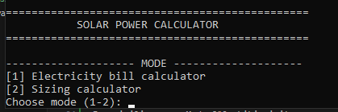
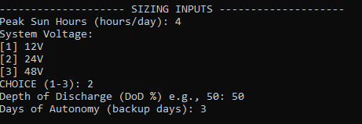
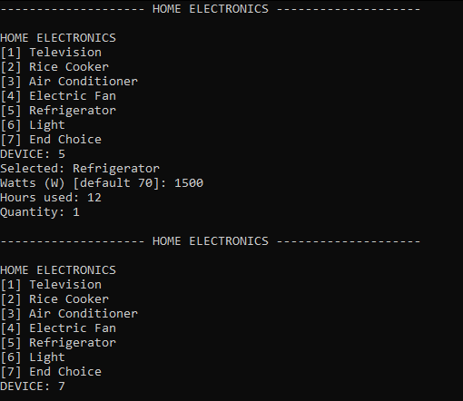
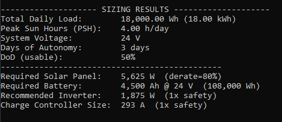

# Solar Power Calculator — Screenshot to Code Map 

Below is a simple walkthrough of each screenshot and where it comes from in the code. I-explain din natin paano gumagana.

---

## 10) Mode selector (New feature entry)

- **What you see**: Two options — [1] Electricity bill calculator, [2] Sizing calculator.
- **Where in code**: `Main.java`
  - Prints MODE menu and reads choice with `promptIntInRange(kb, "Choose mode (1-2): ", 1, 2)`
  - Branches to existing flow (bill) or sizing flow.
- **How it works**: Simple menu gate before running either feature set.

---

## 2) + Rate prompt 

- **What you see**: Banner + section for Rates. Hinihingi ang electricity rate (pesos/kWh).
- **Where in code**: `Main.java`
  - `printBanner("SOLAR POWER CALCULATOR")`
  - `printSection("RATES")`
  - Prompts: `input(...)`, `parseDoubleSafe(...)`, then `devices.setRatePerKWh(rate)`
- **How it works**: Pag enter mo ng rate, ito ang gagamitin para i-compute ang bill sa receipt at final bill after solar.

---

## 3) Solar panel setup (choose size, quantity, sunlight hours)

- **What you see**: List ng panel sizes, then inputs for quantity at sunlight hours.
- **Where in code**:
  - `Main.java`: calls `sPanel.listPanel()`, `promptIntInRange(...)`, `sPanel.setPanelVC(choice)`, `sPanel.setQuantity(...)`, `sPanel.setSunlightHour(...)`
  - `SolarPanel.java`: logic for mapping size → `volt/current`, plus `getRatedPowerW()` and `getDailyEnergyWh()`
- **How it works**: Pinipili mo ang panel specs. Then the app computes rated watts and daily solar energy = `ratedW × sunlightHours`.

---

## 4) Battery setup (voltage, capacity, quantity)

- **What you see**: Menu for battery voltage and capacity (Ah), then quantity.
- **Where in code**:
  - `Main.java`: `sBattery.listVolt()`, `sBattery.setVolt(...)`, `sBattery.listCurrent()`, `sBattery.setCurrent(...)`, `sBattery.setQuantity(...)`
  - `SolarBattery.java`/`Battery.java`: computations for `getEnergyWh()` and display.
- **How it works**: Voltage × Ah × quantity → `batteryWh`. Makikita mo rin later ang bordered battery summary.

---

## 5) Devices menu (pick category) Device details (custom watts, hours, quantity)

- **What you see**: HOME ELECTRONICS list (Television, Rice Cooker, etc.).
- **Where in code**: `ElectronicDevices.java`
  - `listDevices()` prints the menu
  - `getDeviceLabel(int choice)` and `getDeviceWattage(int choice)` provide defaults
- **How it works**: Pipili ka ng device category; may default watts as a guide pero pwede mong i-override.

---

## 6) Closing Device menu

- **What you see**: Home Electronics list is closed and the receipt table is displayed.
- **Where in code**: `ElectronicDevices.java`
  - `displayReceiptWithSolar(double solarWh)` renders the table header/rows
  - when user selects 7, it calls `displayReceiptWithSolar(sPanel.getDailyEnergyWh())`
- **How it works**: when user selects 7, it calls `displayReceiptWithSolar(sPanel.getDailyEnergyWh())` to display the summary and receipt table.

---

## 7) Summary Table of your devices

- **What you see**: Prompts for your device’s watts per hour, hours per day, and quantity.
- **Where in code**:
  - `Main.java`: reads custom watts via `parseDoubleSafe(input(...))`, then `promptPositiveInt` for hours at quantity
  - Calls `devices.addUsageCustom(choice, hours, customWatts, quantity)`
  - `ElectronicDevices.java`: stores item in `receipt` list as a `ReceiptItem`
- **How it works**: Every device entry computes `energyWh = watts × hours × quantity`, then adds to total.

---

## 8) Receipt table (per device energy) Receipt footer with base bill, solar deficit, and final bill

- **What you see**: Totals (Wh/kWh), Base Daily Bill, then After Solar: Solar Energy, Grid Deficit, Final Daily/Monthly Bill.
- **Where in code**: `ElectronicDevices.java`
  - `displayReceiptWithSolar(double solarWh)` computes:
    - `loadWh = getTotalWattHours()`
    - `deficitWh = max(loadWh - solarWh, 0)`
    - `finalDailyBill = (deficitWh/1000) × getRatePerKWh()`
  - Also prints base bill using the total load (for reference), then the final bill (deficit only).
- **How it works**: Binabawas ang solar production sa total load. Kung may kulang (deficit), yun lang ang ibinabayad mo. Daily × 30 → monthly.

---

## 9) Battery summary block & Power source (solar) summary + Estimated daily solar energy 

- **What you see**: Bordered block showing Battery Volt, Current (Ah), and Capacity (Wh).
- **Where in code**: `Battery.java`
  - `showProperty()` prints the bordered block
  - `getEnergyWh()` returns `volt × Ah` (multiplied by quantity handled by `SolarBattery` when applicable)
- **How it works**: This gives you a quick view kung ilang Wh ang battery setup mo.

- **What you see**: Bordered block for Power Source showing Volt (V), Current (A), Power (W), plus a line for estimated daily solar energy.
- **Where in code**:
  - `EnergySource.java`: `showProperty()` for the bordered power block
  - `SolarPanel.java`: `getRatedPowerW()` and `getDailyEnergyWh()`
  - `Main.java`: prints "Estimated daily solar energy: ... Wh"
- **How it works**: Shows the panel’s rated power and the daily energy based on your sunlight hours.

---

## Bonus: Helpful methods to know
- `Main.printBanner`, `Main.printSection` — para sa UI sections.
- `Main.promptPositiveInt`, `Main.promptIntInRange` — input validation.
- `ElectronicDevices.ReceiptItem` — simpleng data holder para sa receipt rows (`label, watts, hours, quantity`).

---

## 11) Sizing inputs (PSH, Voltage, DoD%, Days)

- **What you see**: Prompts for Peak Sun Hours, System Voltage (12/24/48V), DoD %, Days of Autonomy.
- **Where in code**: `Main.java` (sizing branch)
  - `printSection("SIZING INPUTS")`
  - Reads `psh`, selects `systemV` via menu, gets `dodPct`, `days`
- **How it works**: These values feed the sizing formulas for panel, battery, inverter, controller.

---

## 12) Add devices for sizing

- **What you see**: Same device menu as bill mode; enter watts, hours/day, quantity. Finish with option 7.
- **Where in code**: `Main.java` (sizing branch)
  - Device loop uses `devices.addUsageCustom(choice, hours, customWatts, quantity)`
  - Totals computed via `devices.getTotalWattHours()`
- **How it works**: Daily load (Wh) is calculated the same way; sizing uses this total load.

---

## 13) Sizing results (Required sizes)

- **What you see**: Printed results — Required Solar Panel (W), Required Battery (Ah @ V and Wh), Recommended Inverter (W), Charge Controller (A).
- **Where in code**: `Main.java` (sizing compute block)
  - `double derate = 0.8;`
  - `requiredPanelW = ceil(loadWh / (psh * derate))`
  - `requiredBattWh = ceil((loadWh * days) / (DoD%/100))`
  - `requiredBattAh = ceil(requiredBattWh / systemV)`
  - `recommendedInverterW = ceil(devices.getApproxPeakWatts() * 1.25)`
  - `recommendedControllerA = ceil((requiredPanelW / systemV) * 1.25)`
- **Related code**: `ElectronicDevices.java`
  - `getApproxPeakWatts()` sums `watts × quantity` to approximate simultaneous peak for inverter sizing.
- **How it works**: Uses simple rules-of-thumb with safety/derating to produce easy-to-read targets for each component.
